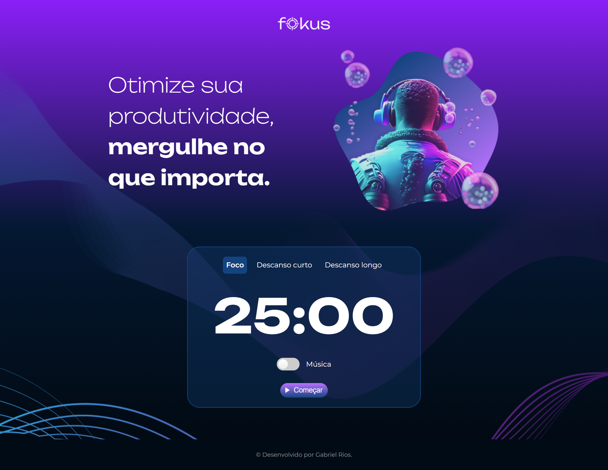

# Fokus - Otimize sua Produtividade

Fokus é uma aplicação web focada em otimizar a sua produtividade, permitindo que você mergulhe nas tarefas que realmente importam. Através de técnicas de gerenciamento de tempo como o Método Pomodoro, Fokus ajuda você a manter o foco, equilibrando períodos de trabalho intenso com intervalos de descanso curtos e longos.

## Tecnologias Utilizadas

Este site foi desenvolvido utilizando as seguintes tecnologias:

-  **HTML5:** Utilizado para estruturar o conteúdo da página web.
-  **CSS3:** Responsável pelo estilo e aparência do site, tornando-o visualmente atraente e responsivo em diferentes dispositivos.
-  **JavaScript:** Implementa a lógica de controle da aplicação, permitindo interações dinâmicas e atualizações em tempo real.

## Funcionalidades Principais

-  **Seleção de Modos:** Permite alternar entre os modos "Foco", "Descanso Curto" e "Descanso Longo", adaptando-se às suas necessidades de concentração e relaxamento.
-  **Música Ambiente:** Possibilidade de habilitar/desabilitar música ambiente durante as sessões de trabalho ou descanso.
-  **Temporizador:** Contador regressivo exibido dinamicamente na página, indicando o tempo restante para a conclusão da sessão de trabalho ou descanso.
-  **Botão de Iniciar/Pausar:** Controle intuitivo para iniciar ou pausar as sessões, proporcionando flexibilidade ao usuário.

## Como Visualizar o Site

Você pode acessar meu site pessoal [clicando aqui](https://projeto-fokus-estudo.vercel.app/).

## Contribuições

Contribuições são bem-vindas! Se você gostaria de contribuir para o projeto, sinta-se à vontade para abrir problemas (issues) e enviar solicitações de pull (pull requests).

## Autor

Gabriel Rios - Desenvolvedor

---

Obrigado por visitar meu repositório! Espero que tenha gostado do meu trabalho.
